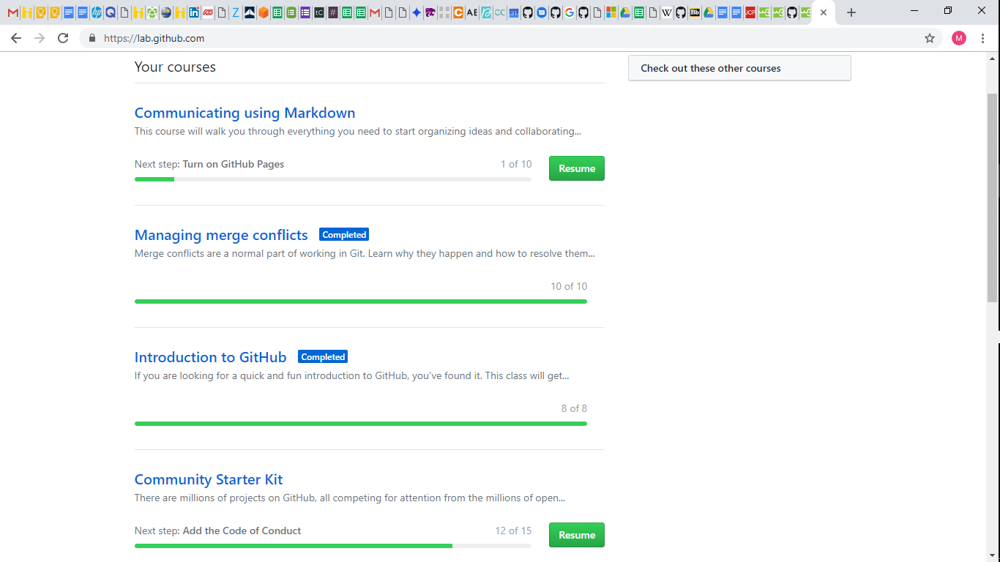
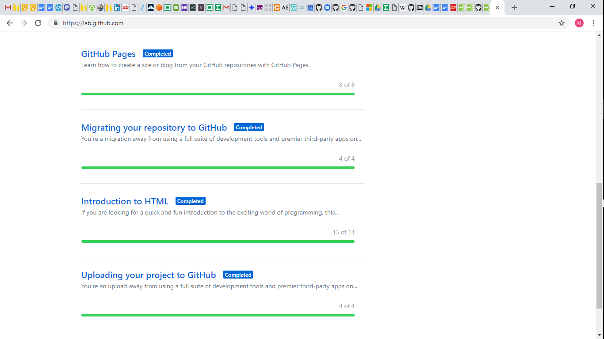

#Technical Skills and Certifications

##Technical Skills

-###Amazon Web Services (AWS)
to be completed

-###GitHub

###Description:
The 8 GitHub labs include an overview of fundamental GitHub skils including:
-GitHub page navigation
-Adding files
-Formatting content using Markdown
-Creating and merging Pull Requests
-Publishing repositories using GitHub Pages
-Contributing to repositories in the GitHub community
-Uploading existing projects to GitHub

###Course Completion

-###Linux
to be completed

-###PowerBI
to be completed3

-###PowerShell
to be completed

##Certifications
-###CSX Cybersecurity Fundamentals
to be completed
schedule to be added by 12/5/18

-###CompTIA Network+ 
to be completed
schedule to be added by 12/5/18
  
