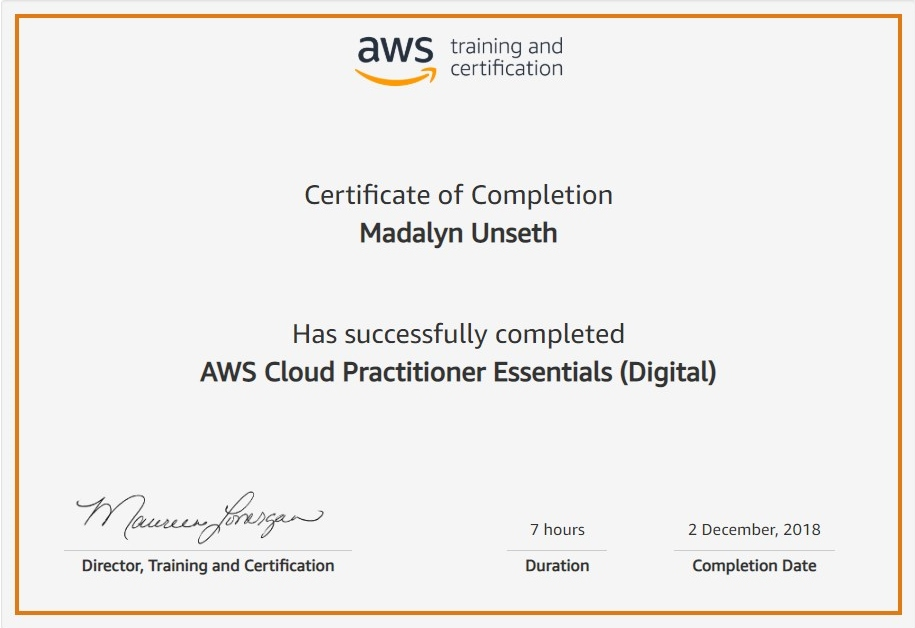
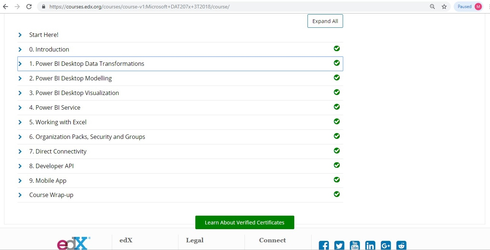
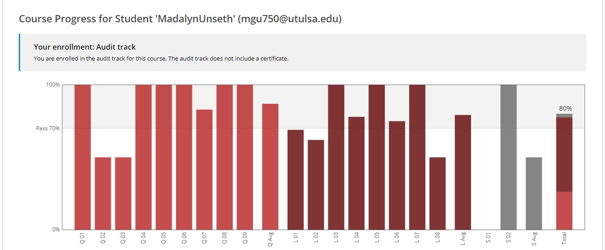
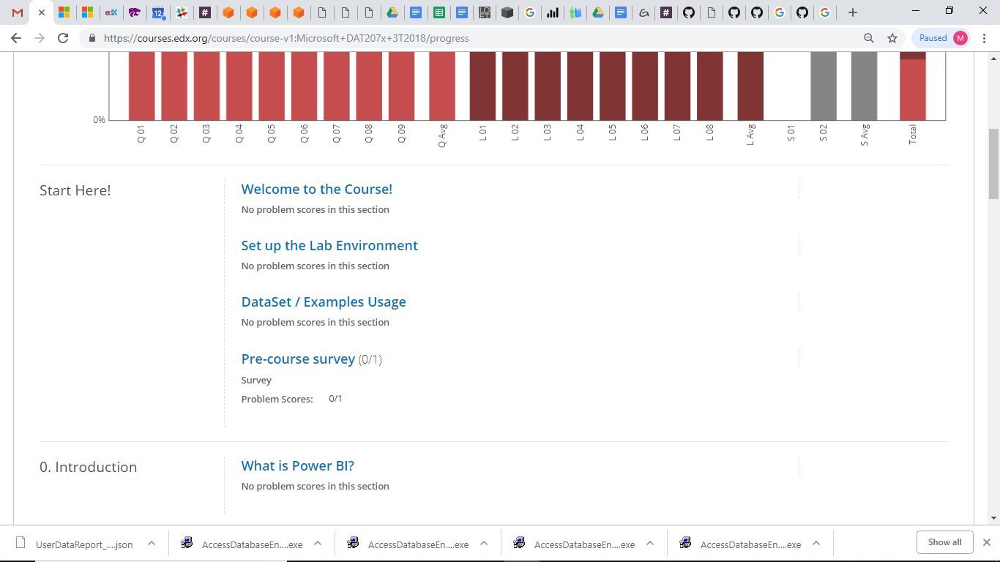
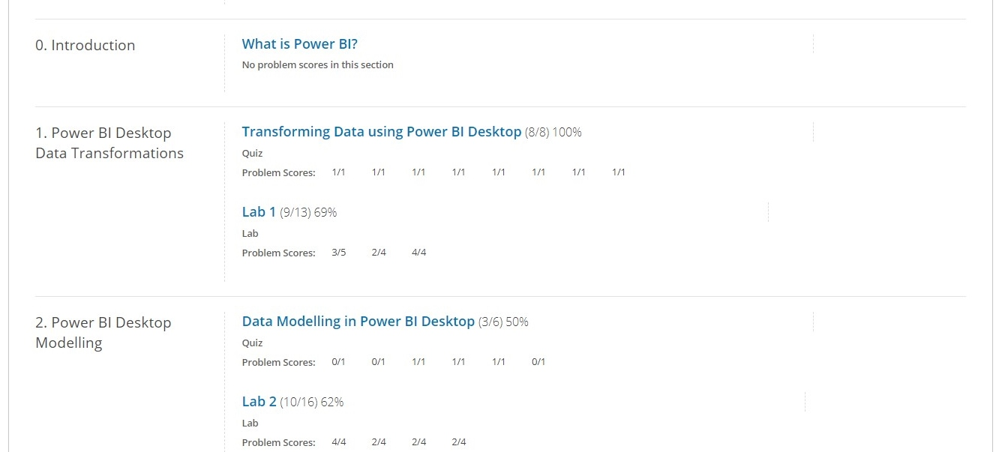
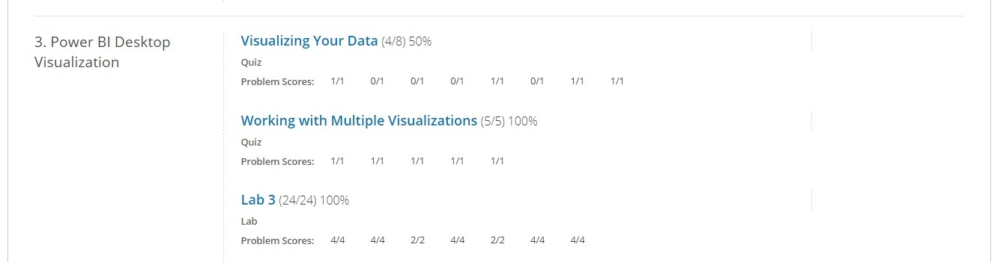
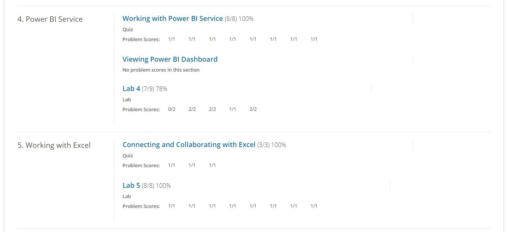
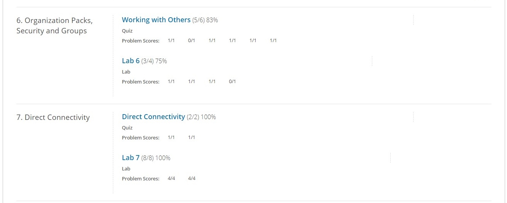
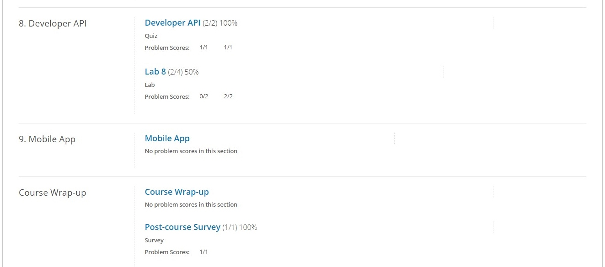

# Technical Skills and Certifications

Please click on the drop-down arrows below to see a description of the technical knowledge gained and proof of completion for each skill.

## Technical Skills

AMAZON WEB SERVICES (AWS)

  
#### Description:
The 8 AWS Courses include an overview of fundamental Amazon Web Services products and capabilities including:
* Definition and benefits of cloud computing
* AWS Core Services (EC2 Cloud, S3 Data Storage, etc.)
* AWS Security (Shared responsibility model, roles, permissions, security certifications)
* AWS Architecting (Pillars: Operational excellence, security, reliability, performance efficiency, cost optimization)
* AWS Pricing and Support (only pay for what you use)
* AWS Product Demonstrations

### Course Completion 
AWS Cloud Practitioner Essentials Course Completion Certificate:

 
 

GITHUB

#### Description:
The 8 GitHub labs include an overview of fundamental GitHub skills including:
* GitHub page navigation
* Adding files
* Formatting content using Markdown
* Creating and merging Pull Requests
* Publishing repositories using GitHub Pages
* Contributing to repositories in the GitHub community
* Uploading existing projects to GitHub

#### Course Completion:

 
 
  

LINUX

#### Description:
The 5 Linux learning modules offer information regarding Linux development, structure, and basic commands including:
* Kernel definition
* Description of Linux development (free, open source OS launched in 1991)
* Explanation of Linux environment (everything acts as a file)
* Linux distributions (Red Hat, Ubuntu, etc.)
* User roles and security (regular, root, service)
* File naming conventions (case sensitive)
* Basic commands (pwd, cd, ls, cat, history, etc.)
* User permissions (read, write, execute)
* Input and Output redirection
* Piping (used to run commands consecutively)
* Searching and filtering files (grep command, sort command)
* Regular expressions (sepcial characters used to search data and create lists)
* Linux environment variables (values that can control or inform system behavior, including: PATH, $LANG, etc.)
* Communicating within networks (Ping, FTP, SSH)
* Managing processes (foreground vs. background processes, ps utility, kill, nice)
* The VI editor (command and insert mode)
* Shell scripting (complex scripts that process input and create output)
* Virtual terminals (allow multiple users to work on the same computer)
* Administration (adding users, managing groups, and access controls)
* Comparison with Unix
* Common interview questions regarding shell scripting, Linux, and Unix

 
 

POWER BI

#### Description:
The 9 Power BI learning modules and corresponding labs include an overview of fundamental data analysis and visualization skills using Power BI. These skills include:
* Manipulating data in the Power BI desktop, indcluding spreadsheets and parameters
* Modeling data thorugh creating columns and tables
* Analyzing and visualizing data thorugh graphs, slicers, and conditional formatting
* Creating and editing dashboards in Power BI Service
* Appropriately formatting Excel to use compatibly with Power BI
* Managing and updating both data content and security
* Creating live connections to servers (through SQL Azure, SQL Database, etc.)
* Developer API
* Power BI mobile phone/tablet compatibility and features

#### Course Completion:

#### Course Performance:

 
 

POWERSHELL

#### Description:
The PowerShell Beginner course learning path included 2 modules: Getting Started with Microsoft PowerShell and
Getting Started with PowerShell Desired State Configuration (DSC). The modules provided an overview of PowerShell logic and syntax, They also provided viewers methods to continue learning on their own. These modules covered the following core PowerShell concepts:

Getting Started with Microsoft PowerShell
* PowerShell purpose and launching
* PowerShell commandlets
* Effective use of the help system
* Using the pipeline to create more powerful code through combining commands
* Using objects
* Using PowerShell remotely
* Automation
* Basic scripting

Getting Started with PowerShell Desired State Configuration (DSC)
* DSC architecture (push/pull)
* Idempotent scripting
* Webserver configuration
* Configuring pull servers for deployment (SMB and HTTPS)
* Configuring pus servers for deployment
* Using built-in resources and add-ins
* Parameterized configurations
* Creating and encrypting credentials
* Common code practices
* DSC and Linux

#### Course Completion:

 
 

## Certifications

CSX CYBERSECURITY FUNDAMENTALS

#### Description:
The CSX Cybersecurity Fundamentals certification offers an overview of important cybersecurity concepts including:
* Risk framework
* Common attacks
* Cybersecurity controls
* Security architecture
* Defense in depth
* Encryption
* Risk assessments and vulnerability management
* Security of operating systems, applications, and data
* Incident response
* Disaster recovery and business continuity planning

#### Completion Schedule:
* Week 1 (1/6/19-1/12/19): Review sections 1 and 2
* Week 2 (1/13/19-1/19/19): Review sections 3 and 4
* Week 3 (1/20/19-1/26/19): Review sections 5 and 6
* Week 4 (1/27/19-2/1/19): Review Vocabulary

Potential exam date: 2/2/19

